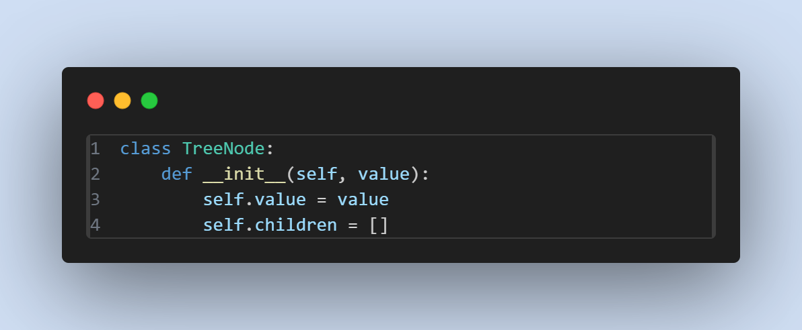
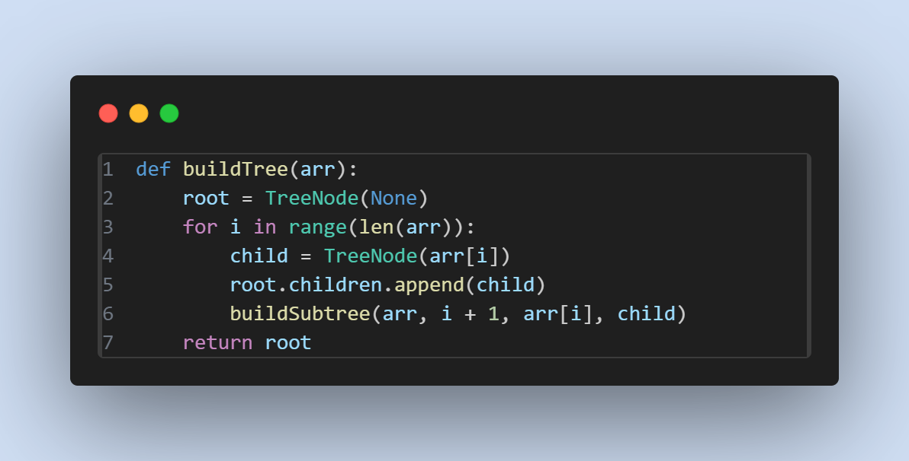
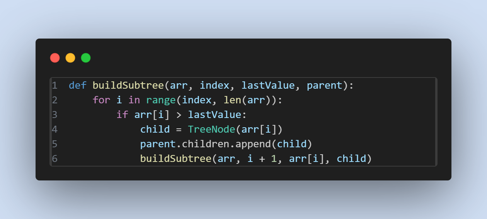
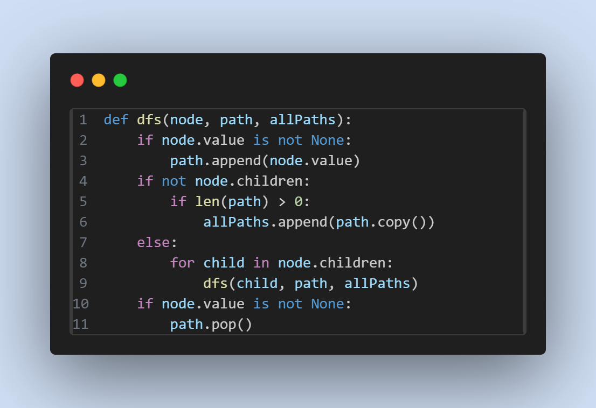
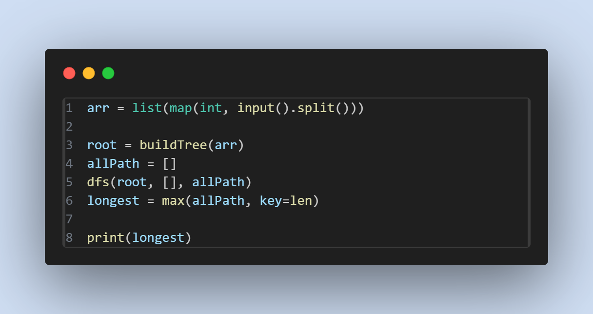

# Longest Monotonically Increasing Subsequence

Implementasi Longest Monotonically Increasing Subsequence (aplikasi menggunakan tree)

`Penjelasan algoritma `
1. Input berupa sequence dengan notasi angka yang dipisahkan oleh spasi tanpa tanda koma. 
2. Tree akan dibuat untuk memetakan semua kemungkinan increasing subsequence yang mungkin terbentuk. 
3. Untuk mencari subsequence terpanjang, pencarian dilakukan menggunakan DFS yang setiap sequence yang di track akan disimpan pada sebuah array. 
4. Setelah melakukan DFS dan mendapat subsequence terpanjang, program akan melakukan print pada subsequence terpanjang yang sudah tercatat. 

`Penjelasan kode`

Bagian ini merupakan pembuat blueprint untuk node yang akan digunakan dalam tree. `value` akan menyimpan integer yang diterima dari input, `children` merupakan integer/subsequence yang bernilai lebih besar dari `value`. 


Bagian ini merupakan constructor dari tree utama, karena belum menerima input, root diberi value `none` untuk menandakan bahwa tree tersebut kosong. Looping akan dilakukan untuk mengakses sequence utama untuk membuat tree. Untuk membuat subtree, function `buildSubtree` dipanggil pada setiap loop. 


Function `buildSubtree` ini merupakan bagian untuk membuat subtree, dan tempat dimana "increasing subsequence" dapat terbuat, karena pada bagian dalam code nya, dimana dia akan membuat subtree jika nilai yang sekarang lebih besar dibandingkan nilai sebelumnya. Terdapat pemanggilan function `buildSubtree` secara recursive untuk mencari nilai berikutnya yang valid dengan kriteria yang diminta, sehingga pembuatan subtree akan dilakukan sampai menemukan node dengan angka terbesar. 


Fungtion `dfs` ini bertugas untuk mencari longest subsequence, atau tree dengan path terdalam. Subsequence terpanjang akan disimpan pada variabel `allPath`.


Pada bagian ini, merupakan tempat dimana user dapat memasukan input, dan tempat untuk memanggil function yang diperlukan. Setelah user melakukan input, tree dibuat dengan memanggil `buildTree`, kemudian mengalokasikan variabel `allPath` untuk menyimpan semua path yang ada. Variabel `allPath` kemudian dipassing ke function dfs untuk mengisi variabel tersebut dengan semua kemungkinan path yang ada. Kemudian untuk mengambil path terpanjang, atau longest monotonically increasing subsequence, dapat menggunakan `max` yang disimpan pada variabel `longest`. Terakhir, variabel `longest` di print untuk menunjukan increasing subsequence terpanjang.  

Contoh Input : 
```
a1, a2, a3, ..., an
```

Contoh Output : 

`Case 1`

Input 
```
1 2 3 4 5
```

Output : 
```
[1, 2, 3, 4, 5]
```

`Case 2`

Input 
```
5 4 3 2 1
```

Output : 
```
[5]
```

`Case 3`

Input 
```
3 10 4 12 5 6 8 9
```

Output : 
```
[3, 4, 5, 6, 8, 9]
```

`Case 4`

Input 
```
4 1 13 7 0 2 8 11 3
```

Output : 
```
[4, 7, 8, 11]
```